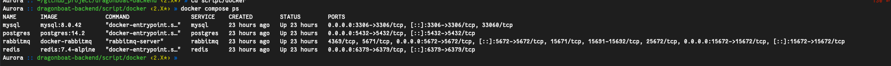
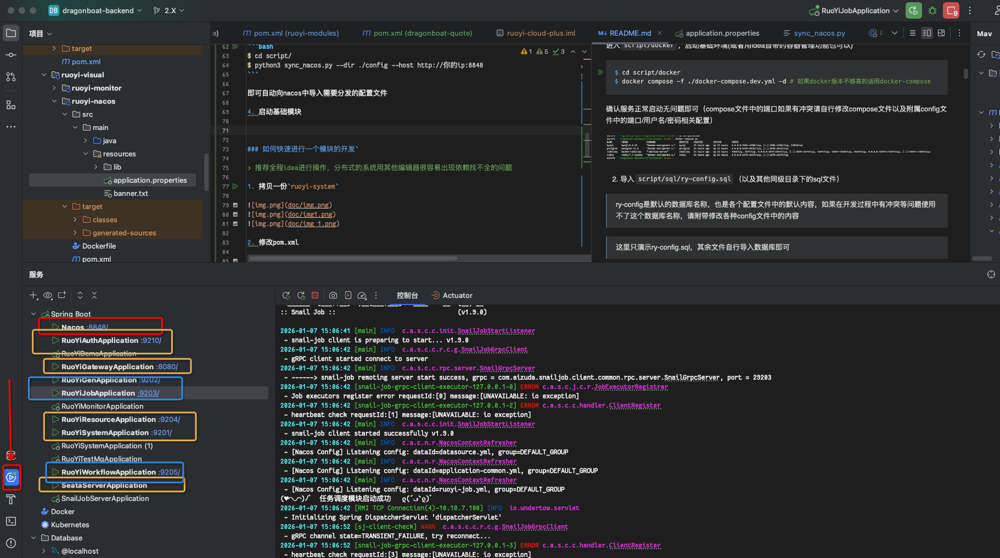
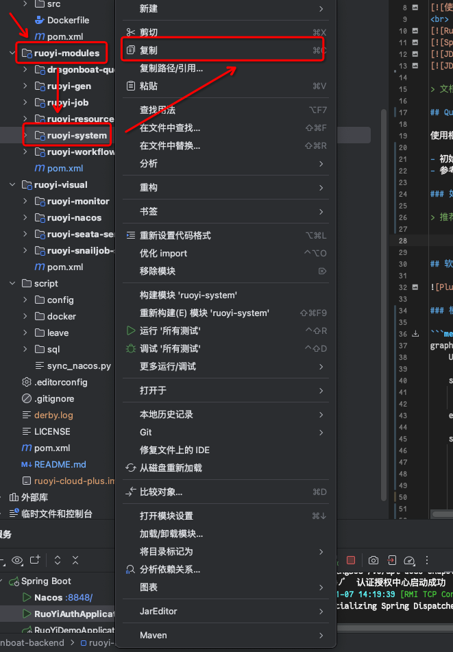
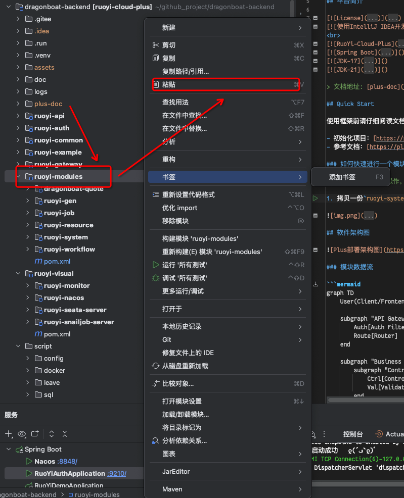
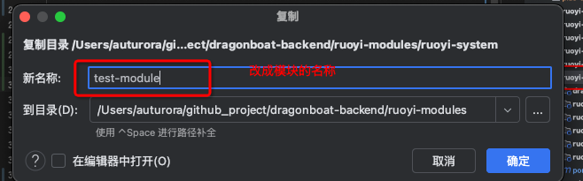
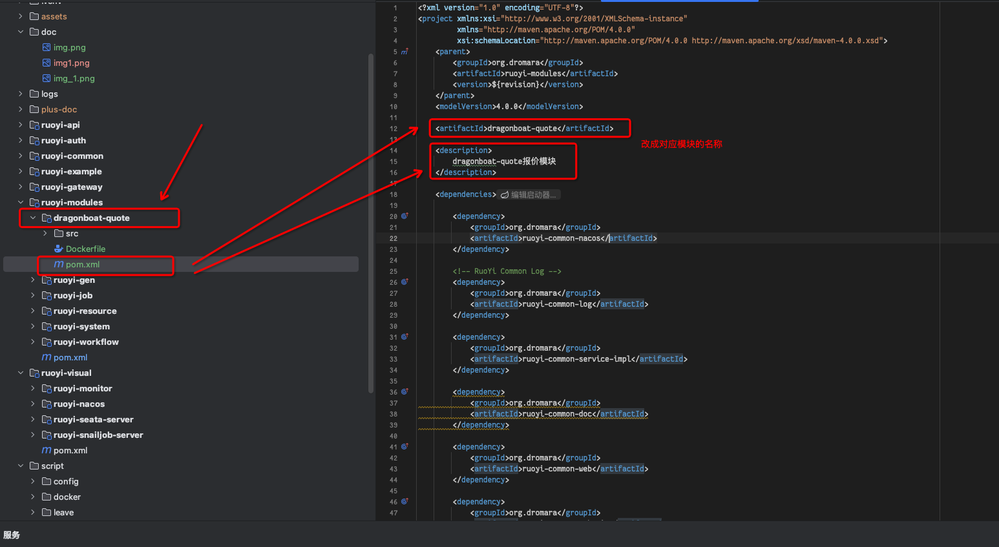
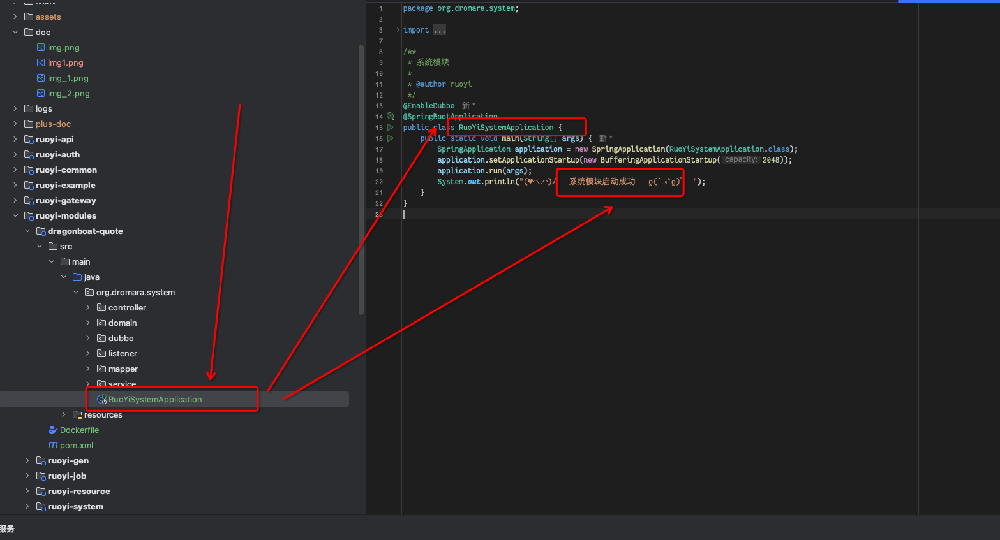
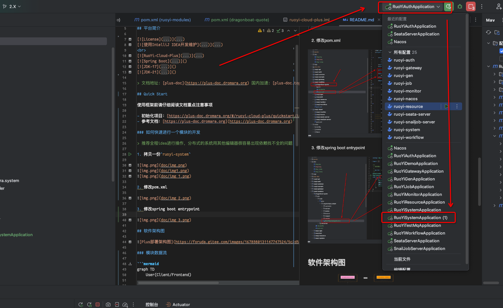
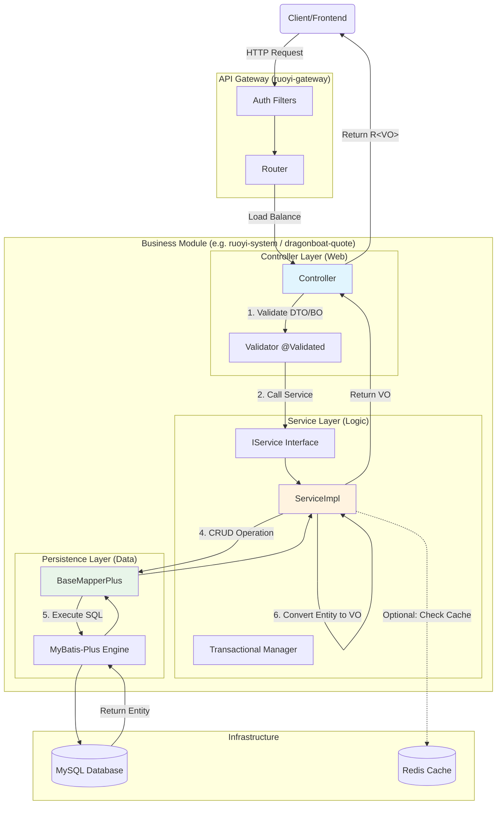

<div style="height: 10px; clear: both;"></div>

使用**Ruoyi-Cloud-Plus**项目作为底座进行整体的项目开发流程

- - -
## 平台简介

[](LICENSE)
[](https://www.jetbrains.com/?from=RuoYi-Cloud-Plus)
<br>
[](https://gitee.com/dromara/RuoYi-Cloud-Plus)
[]()
[]()
[]()

> 文档地址: [plus-doc](https://plus-doc.dromara.org) 国内加速: [plus-doc.top](https://plus-doc.top)

## Quick Start

使用框架前请仔细阅读文档重点注意事项

- 初始化项目：[https://plus-doc.dromara.org/#/ruoyi-cloud-plus/quickstart/init](https://plus-doc.dromara.org/#/ruoyi-cloud-plus/quickstart/init)
- 参考文档：[https://plus-doc.dromara.org](https://plus-doc.dromara.org)

项目整体运行环境

- java 17/21

### 怎么启动

> 项目初期先简单为主，使用`mysql8.0`进行开发，后期切到`postgres14`进行交付

1. 启动基础运行环境

项目整体以DDD为导向，数据库存储持久化运行数据，redis负责分布式cache，rabbitmq负责监听数据变化

进入`script/docker`，启动基础环境(或者用idea自带的容器管理功能也可以)

```bash
$ cd script/docker
$ docker compose -f ./docker-compose.dev.yml -d # 如果docker版本不够高的话用docker-compose
```

确认服务正常启动无问题即可（compose文件中的端口如果有冲突请自行修改compose文件以及附属config文件中的端口/用户名/密码相关配置）



2. 导入`script/sql/ry-config.sql`（以及其他同级目录下的sql文件）

> ry-config是默认的数据库名称，也是各个配置文件中的默认内容，如果在开发过程中有冲突等问题使用不了这个数据库名称，请附带修改各种config文件中的内容

> 这里只演示ry-config.sql，其余文件自行导入数据库即可

> 同时在这之前请确保安装了mysql client

```bash
$ mysql -h127.0.0.1 -P3306 -uroot -p'root' -e 'CREATE DATABASE IF NOT EXISTS `ry-config` DEFAULT CHARACTER SET utf8mb4 COLLATE utf8mb4_general_ci;' 
$ mysql -u 用户名 -p -h 主机地址 ry-config < script/sql/ry-config.sql
```

3. 导入nacos配置

参考上述文档中的内容修改`script/config`下的配置文件（数据库地址，用户名，密码，code gen master等内容）后

修改`ruoyi-visual/ruoyi-nacos/src/resources/application.properties:L42-45`相关的数据库配置内容

```bash
$ cd script/
$ python3 sync_nacos.py --dir ./config --host http://你的ip:8848
```

即可自动向nacos中导入需要分发的配置文件

4. 启动基础模块



红框内为必须第一个启动的，黄框为必须第二步全部启动的，蓝框为拓展模块可选启动

### 如何快速进行一个模块的开发

> 推荐全程idea进行操作，分布式的系统用其他编辑器很容易出现依赖找不全的问题

1. 拷贝一份`ruoyi-system`





2. 修改pom.xml



3. 修改spring boot entrypoint



确认idea的spring启动项中有配置好的启动内容即可进行开发



## 软件架构图


### 单模块通用数据流

